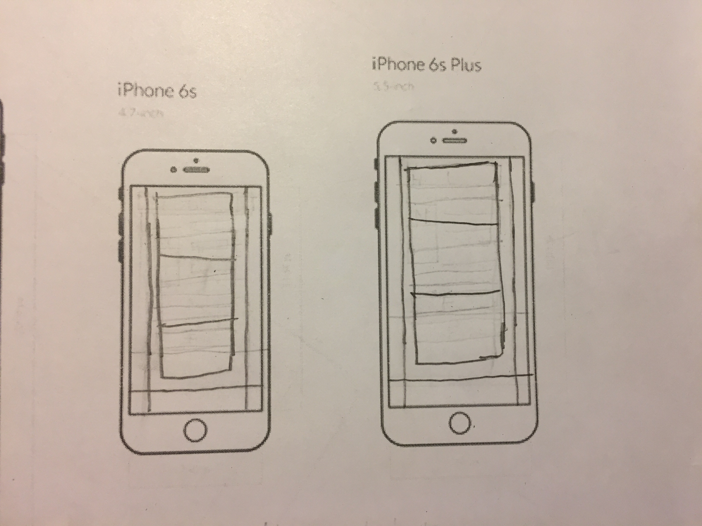
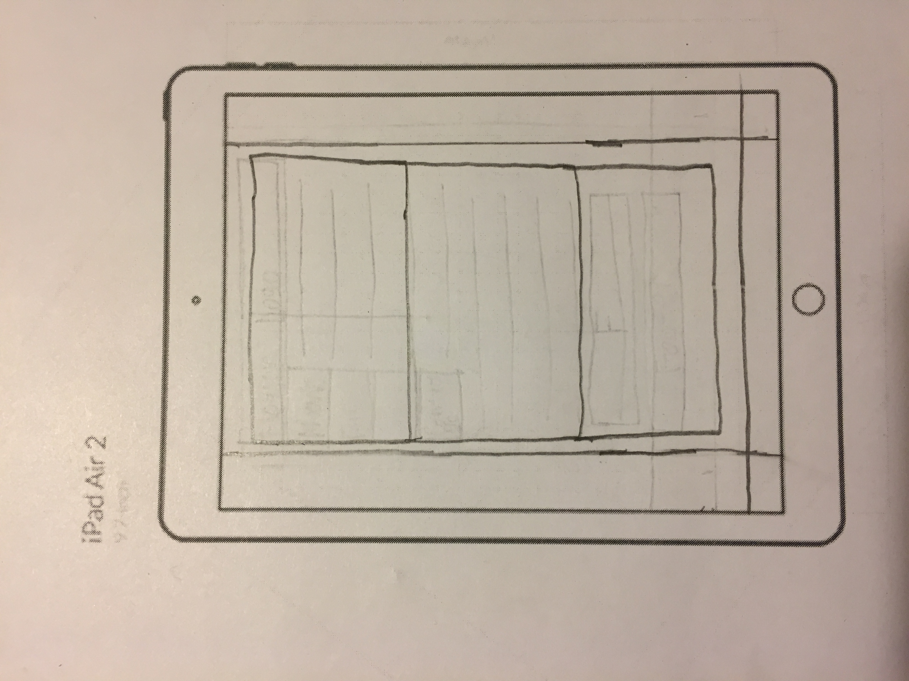
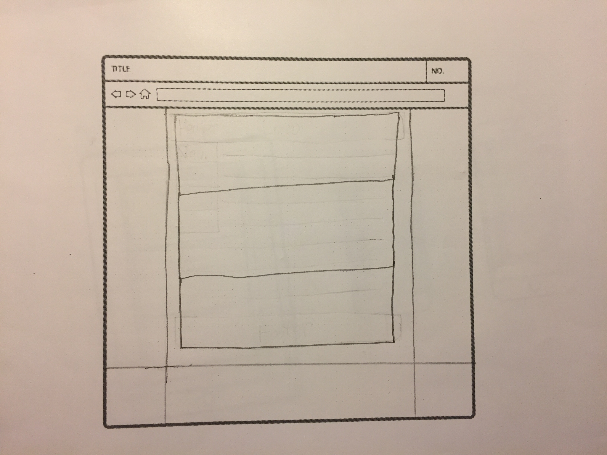

# Jacob Williams 51

- The information that my page is trying to deliver is some basic information about RWD.
- The first information on the page that I'm trying to draw the eye to is the bolded content in the top box.  Then the reader's eye will continue to go downward as it reads along.
- The primary content of my page tells why web designers should take a RWD approach to web designing.
- The secondary content of my page just tells a little about RWD and how wireframes play a role in it.

## Sketches:

## Work Process:
- I went with the earthly color palette I chose because I thought it was an interesting and beautiful color scheme, no specific reason really.
- I didn't want to spend a lot of time trying to find some interesting fonts, so I just stuck with the basic sans-serif font family for my page.
- In order to create a reading transition from top to bottom, I used headings three and four to make my content big on top, and leave a standard paragraph element to make my content small on the bottom.
- My page may look like something simple and nothing too interesting, but all I was trying to do this week was to understand how RWD elements work and how to use them on my webpage.

To be honest, this was kind of a pain in the ass assignment.  I thought I was understanding the week's content pretty decently, I just had a hard time trying to make my page match my sketches (height and width wise).

I'm kind of having doubts of my final web project, seeing how I might have to do this as one of the requirements.
