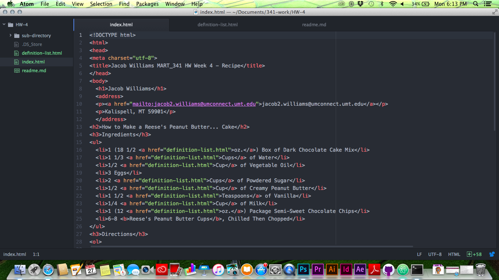
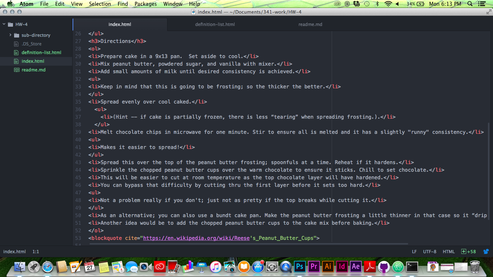
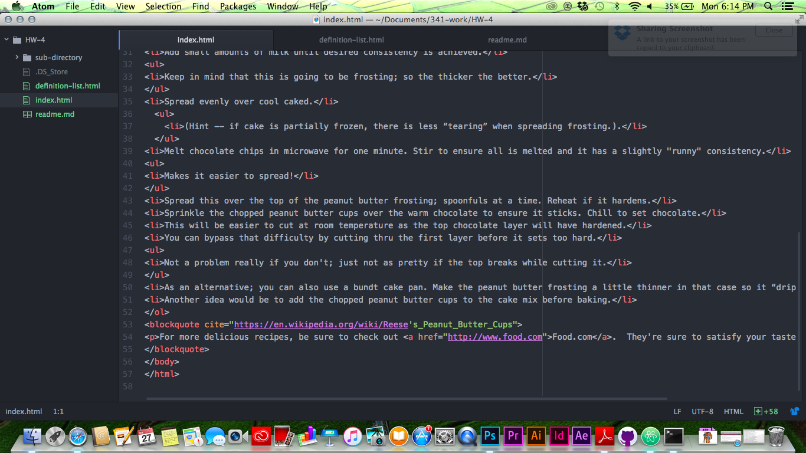
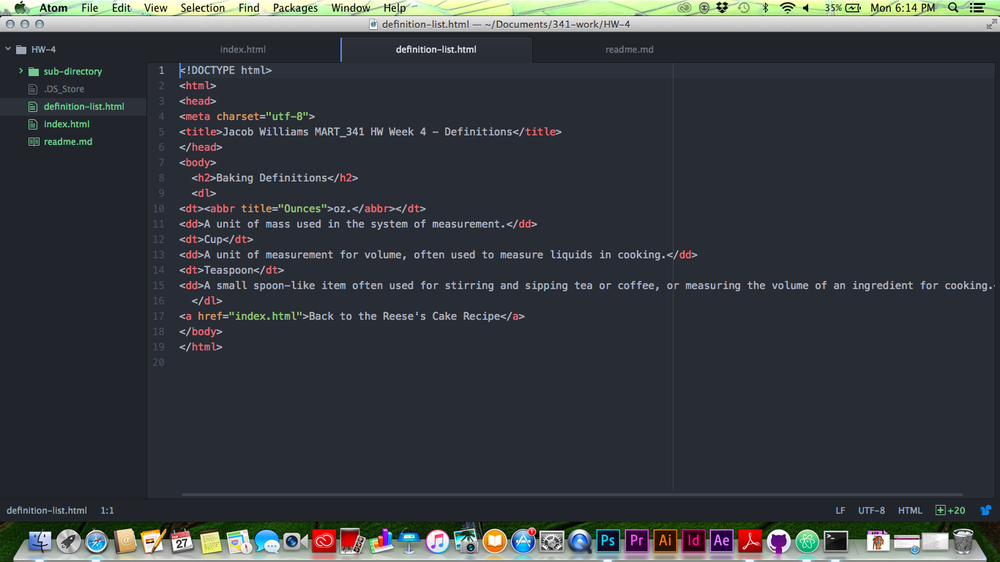
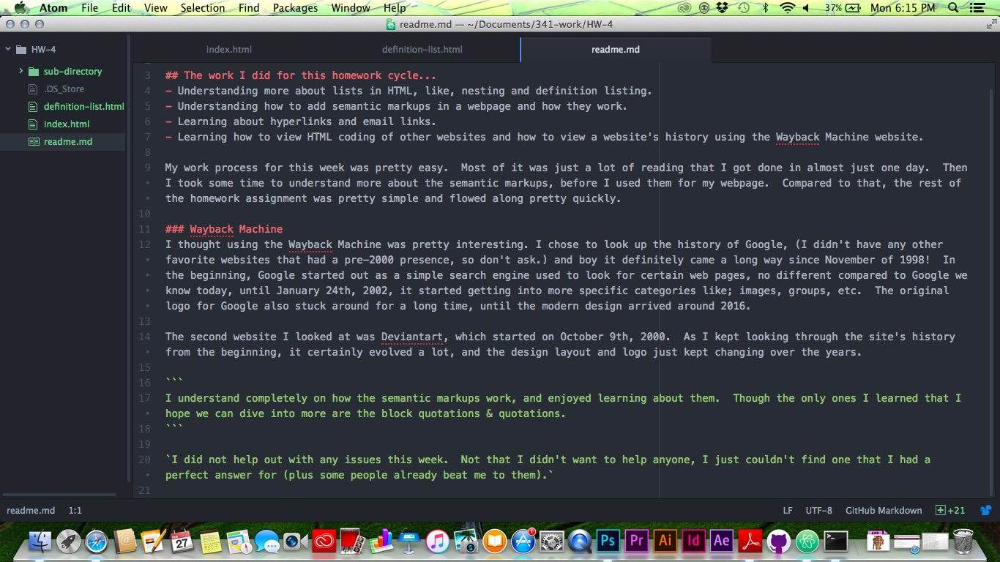

# Jacob Williams 51

## The work I did for this homework cycle...
- Understanding more about lists in HTML, like, nesting and definition listing.
- Understanding how to add semantic markups in a webpage and how they work.
- Learning about hyperlinks and email links.
- Learning how to view HTML coding of other websites and how to view a website's history using the Wayback Machine website.

My work process for this week was pretty easy.  Most of it was just a lot of reading that I got done in almost just one day.  Then I took some time to understand more about the semantic markups, before I used them for my webpage.  Compared to that, the rest of the homework assignment was pretty simple and flowed along pretty quickly.

### Wayback Machine
I thought using the Wayback Machine was pretty interesting. I chose to look up the history of Google, (I didn't have any other favorite websites that had a pre-2000 presence, so don't ask.) and boy it definitely came a long way since November of 1998!  In the beginning, Google started out as a simple search engine used to look for certain web pages, no different compared to Google we know today, until January 24th, 2002, it started getting into more specific categories like; images, groups, etc.  The original logo for Google also stuck around for a long time, until the modern design arrived around 2016.

The second website I looked at was Deviantart, which started on October 9th, 2000.  As I kept looking through the site's history from the beginning, it certainly evolved a lot, and the design layout and logo just kept changing over the years.

```
I understand completely on how the semantic markups work, and enjoyed learning about them.  Though the only ones I learned that I hope we can dive into more are the block quotations & quotations.
```

`I did not help out with any issues this week.  Not that I didn't want to help anyone, I just couldn't find one that I had a perfect answer for (plus some people already beat me to them).`

These are the screenshots of my work for this week that I did in Atom.





