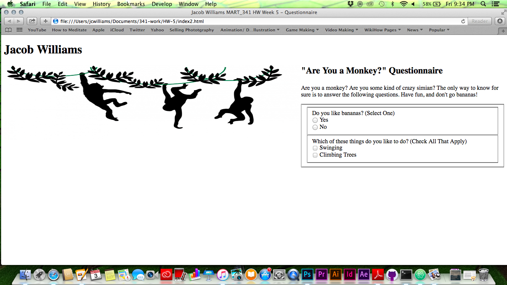
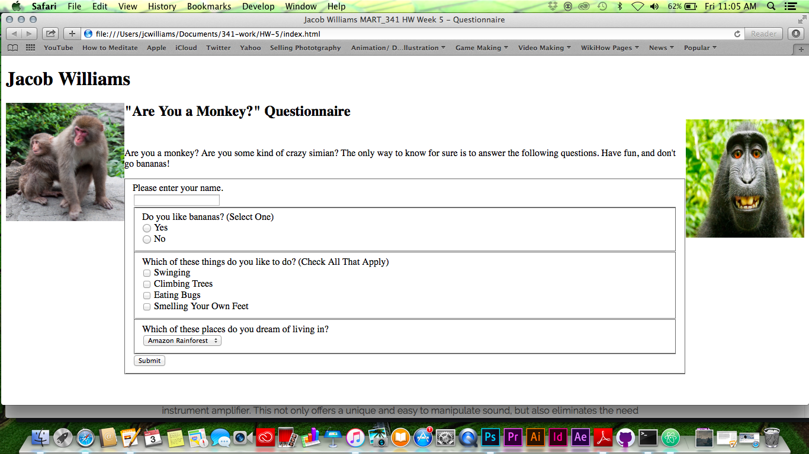
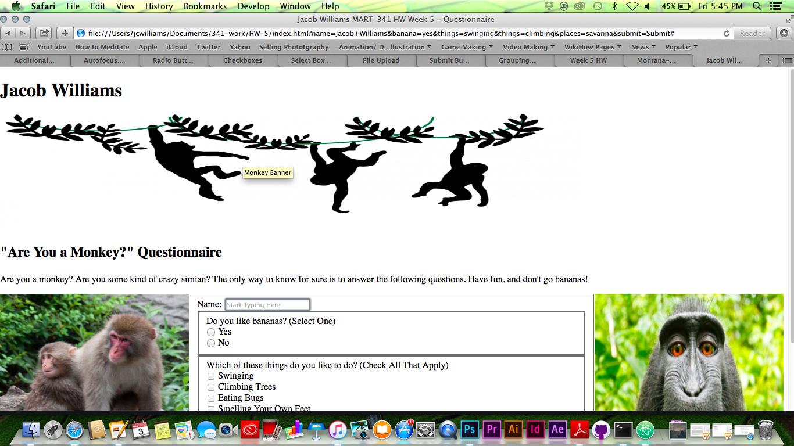
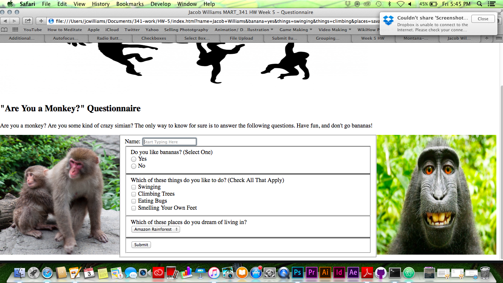

# Jacob Williams 51

## The work I did for this homework cycle...
- Learning about images and how to place them in HTML documents.
- Learning about forms (that was pretty much a new thing for me, I admit that).

My work process was pretty challenging this week.  I read over all the contents for this week at least once before I jumped into the assignment, then I would read them over again while doing my assignment.  On the night I got started on the homework, I panicked a little bit trying to understand it but after a quick breather (and a nice delicious dinner ), I managed to get my thoughts together and pull through.

At first, I was having trouble with understanding most of the forms and how to type the codes in.  I wanted to post this issue on the Github website, but after taking some time away from the assignment, I eventually figured it out on my own.

Even though learning about forms was challenging at first, I thought that it was all pretty interesting.  I'm hoping that we'll get to review and dive more into it later in the semester.

`I helped out with one issue this week.  A fellow student was having trouble understanding what a "child directory" was.  I told them that it was simply just another folder to store your website's image files in, then I gave them an example of an image code I used for this week's homework.`

Work Process:

