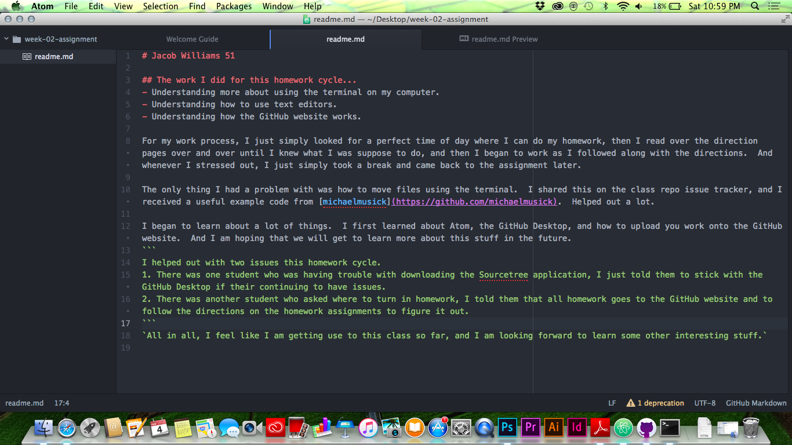

# Jacob Williams 51

## The work I did for this homework cycle...
- Understanding more about using the terminal on my computer.
- Understanding how to use text editors.
- Understanding how the GitHub website works.

For my work process, I just simply looked for a perfect time of day where I can do my homework, then I read over the direction pages over and over until I knew what I was suppose to do, and then I began to work as I followed along with the directions.  And whenever I stressed out, I just simply took a break and came back to the assignment later.

The only thing I had a problem with was how to move files using the terminal.  I shared this on the class repo issue tracker, and I received a useful example code from [michaelmusick](https://github.com/michaelmusick).  Helped out a lot.

I began to learn about a lot of things.  I first learned about Atom, the GitHub Desktop, and how to upload you work onto the GitHub website.  And I am hoping that we will get to learn more about this stuff in the future.
```
I helped out with two issues this homework cycle.
1. There was one student who was having trouble with downloading the Sourcetree application, I just told them to stick with the GitHub Desktop if their continuing to have issues.
2. There was another student who asked where to turn in homework, I told them that all homework goes to the GitHub website and to follow the directions on the homework assignments to figure it out.
```
`All in all, I feel like I am getting use to this class so far, and I am looking forward to learn some other interesting stuff.`


